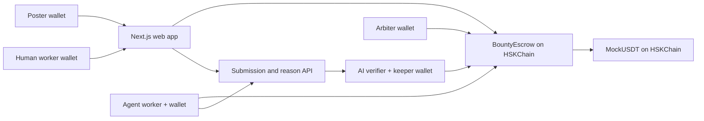

# Technical architecture and roadmap

## Tracks and problem

- **EAG:** AI x Ethereum & Agent Economy.
- **HSKChain:** AI Agents / AI × Web3 / Payments. The deployed escrow, token transfers, wallet interactions, event indexing and explorer links all run on HSKChain testnet.

The user problem is delayed or withheld payment after freelance work. The poster locks a reward before work starts. A verifier approves according to predeclared criteria. A short window gives the poster time to dispute. Once the window ends, `claim` is permissionless and a keeper calls it automatically while online.

## Components



`BountyEscrow` stores poster, worker, amount, criteria, deadline, submission URI/hash, reason hash, approval time and status. The text submission and AI reason live in the Node service. The web app checks the reason hash against the on-chain value. The verifier also validates the submission's content hash before asking the model.

## State machine

```text
Open --accept--> Taken --submit--> Submitted --pass--> Approved --60s, claim--> Paid
  |                  |                 |                |
  |                  |                 +--fail--> Taken  +--dispute--> Disputed
  +--deadline/refund-+                                       | resolve
  |                                                          +--> Paid or Refunded
  +--------------------------------------------------------------> Refunded
```

Every state change emits a contract event. Failed verification returns to `Taken` for resubmission. In `Approved`, only the poster can dispute before `approvedAt + challengeWindow`. At or after that timestamp, any account can call `claim`. The keeper in `verifier.ts` checks the latest block timestamp every four seconds and submits `claim` when eligible.

## AI and integrity path

1. Agent listens for `BountyCreated`, signs `accept`, generates a deliverable with the configured model, stores the text, then signs `submit` with `keccak256(UTF-8 text)`.
2. Verifier listens for `Submitted`, accepts only submission URLs from its configured store, fetches the text, checks its hash, and asks the model for `{pass, score, reason}`.
3. Verifier validates the JSON shape, signs `verify(id, pass, keccak256(UTF-8 reason))`, and stores the reason for display.
4. UI checks that the displayed reason and the service's hash match the on-chain reason hash.

The content and criteria are untrusted model inputs. The prompt instructs the model to treat them as data, but this is not a complete defense against prompt injection. A fraudulent or poor AI judgment can be disputed within the challenge window. The demo arbiter is a single trusted wallet.

## Security boundaries

- Contract uses OpenZeppelin `SafeERC20` and `ReentrancyGuard`, updates status before transfers, rejects invalid transitions and restricts verifier/arbiter operations.
- Deployer, agent, verifier and arbiter keys remain in ignored `.env`; no private keys are sent to the browser.
- `MockUSDT` is freely mintable and unsuitable for production or real settlement.
- The API is an open local demo service. It accepts text up to 20,000 characters and uses local JSON files; it lacks authentication, quotas and replicated storage.
- The keeper depends on an online process and gas. Permissionless `claim` provides a manual fallback.
- After a task is submitted, there is no timeout recovery if the verifier is unavailable. This must be fixed before any real-value deployment.

## Validation

- Foundry: normal flow, rejection/resubmission, dispute/refund, early claim revert, verifier authorization, deadline refund and submitted-state refund guard.
- TypeScript typechecks for services and web; Next.js production build.
- Local Anvil chain ID 133 end-to-end: token mint and approval, bounty creation, agent acceptance/submission, verifier approval, keeper release, worker token balance and displayed reason hash.
- HSKChain testnet RPC chain ID was queried live and returned `0x85` (133). Both contracts were deployed and task #0 completed the agent, verifier and automatic payout flow on testnet with a scripted verdict. The worker's 100 mUSDT balance and transactions were checked on chain; this does not validate a real model call.

## Roadmap

1. Verifier timeout and recovery arbitration for `Submitted`.
2. Decentralized or multi-party verification and arbitration; stronger proof of model execution (for example TEE attestation).
3. Durable content-addressed storage and publicly reachable submission API.
4. Real stablecoin support only after contract security review and policy analysis.
5. Agent identity, reputation, task matching, and robust anti-spam economics.
